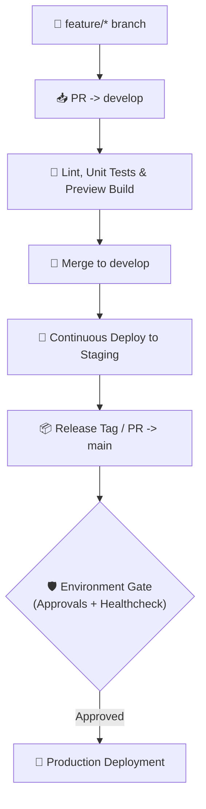

# 🔄 Deployment Strategy Sandbox (Nx & Continuous Delivery)

<a alt="Nx logo" href="https://nx.dev" target="_blank" rel="noreferrer"></a>

[](https://github.com/jgu7man/deployment-strategy)
[](https://nx.dev)
[](https://firebase.google.com)
[](LICENSE)

An architectural sandbox exploring **continuous delivery strategies, branch lifecycle management, automated staging promotions, and zero-downtime release pipelines** using GitHub Actions and Nx Monorepo workflows.

---

## 💡 Architecture & Workflow Strategy

This repository showcases automated deployment blueprints designed for scalable engineering teams:



---

## ✨ Deployment Patterns Explored

1. **Ephemeral Preview Channels:** Automatically deploys Firebase Hosting preview channels per Pull Request.
2. **Environment Promotion Gates:** Required reviewers and automated health checks before promoting builds from Staging to Production.
3. **Rollback Automation:** Triggers automated reversion workflows upon detecting deployment health anomalies.

---

## 🛠️ Nx Monorepo Commands

✨ **This workspace has been generated by [Nx, a Smart, fast and extensible build system.](https://nx.dev)** ✨

### Start the app
To start the development server run:
```bash
npx nx serve demo
```
Open your browser and navigate to `http://localhost:4200/`.

### Generate code
If you happen to use Nx plugins, you can leverage code generators that might come with it:
```bash
npx nx list
```
Learn more about [Nx generators in the docs](https://nx.dev/plugin-features/use-code-generators).

### Running tasks
To execute tasks with Nx use the following syntax:
```bash
npx nx <target> <project> <...options>
```

You can also run multiple targets:
```bash
npx nx run-many -t <target1> <target2>
```
...or add `-p` to filter specific projects:
```bash
npx nx run-many -t <target1> <target2> -p <proj1> <proj2>
```

Targets can be defined in `package.json` or `project.json`. Learn more [in the docs](https://nx.dev/core-features/run-tasks).

### Build for Production
Run:
```bash
npx nx build demo
```
The build artifacts will be stored in the `dist/` directory, ready to be deployed.

### Setting up CI with Remote Caching
Nx comes with local caching already built-in (check your `nx.json`). On CI you can enable remote caching across multiple runners:
- [Set up remote caching](https://nx.dev/core-features/share-your-cache)
- [Set up task distribution across multiple machines](https://nx.dev/nx-cloud/features/distribute-task-execution)
- [Learn more about setting up CI](https://nx.dev/recipes/ci)

---

## 📄 License
Distributed under the [MIT License](LICENSE). Created by [Jorge Guzmán (@jgu7man)](https://github.com/jgu7man).
